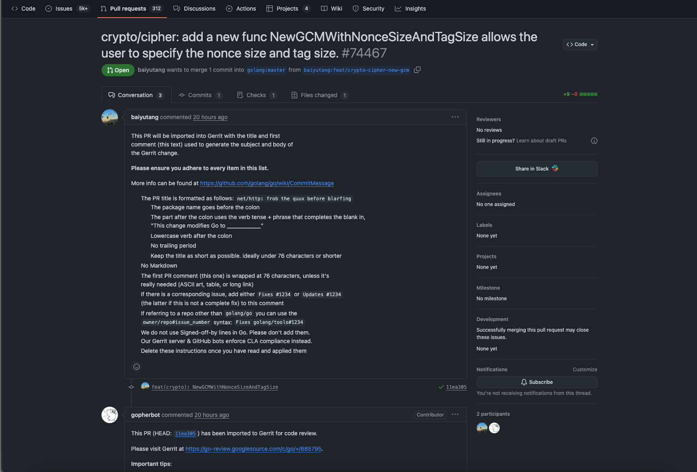

# GitHub PR to Slack Sharing

A Chrome extension that allows you to share GitHub Pull Requests to Slack with a predefined template.

## Features

- Share GitHub PRs to Slack with a single click via an inline button
- Customizable Slack webhook URL
- Seamless integration into GitHub's PR interface
- Includes PR title and URL in the Slack message
- Settings are saved in Chrome sync storage



## Setup

1. Clone this repository
2. Install dependencies:
   ```bash
   pnpm install
   ```
3. Build the extension:
   ```bash
   pnpm run build
   ```
4. Load the extension in Chrome:
   - Open Chrome and go to `chrome://extensions`
   - Enable "Developer mode" in the top right
   - Click "Load unpacked" and select the `dist` directory

## Usage

1. Create a Slack Incoming Webhook:
   - Go to your Slack workspace's App Directory
   - Create a new app or use an existing one
   - Enable Incoming Webhooks
   - Create a new webhook URL for your desired channel

2. Configure the extension:
   - Click the extension icon in Chrome
   - Enter your Slack webhook URL (this includes the target channel)
   - Click "Save Settings"

3. Share a PR:
   - Navigate to any GitHub Pull Request
   - Click the extension icon
   - Click "Share PR"

## Development

To work on the extension:

1. Run the development server:
   ```bash
   pnpm run dev
   ```
2. Make your changes in the `src` directory
3. Vite will automatically rebuild when files change
4. Reload the extension in Chrome to see your changes

The project uses:
- Vite for building
- TypeScript for type safety
- Tailwind CSS for styling
- CRXJS for extension bundling

## File Structure

- `src/manifest.json` - Extension manifest
- `src/popup.ts` - Popup UI and functionality
- `src/content.ts` - Content script for extracting PR information
- `src/settings.ts` - Settings management
- `src/background.ts` - Background script
- `src/input.css` - Tailwind CSS styles
- `src/types.ts` - TypeScript type definitions
- `src/global.d.ts` - Global type declarations
